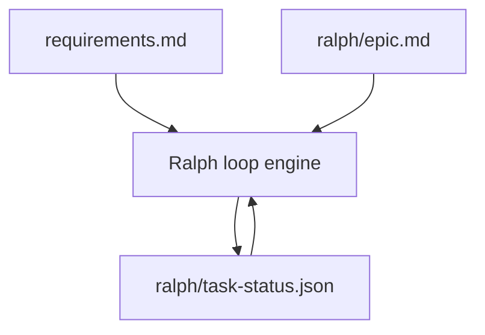
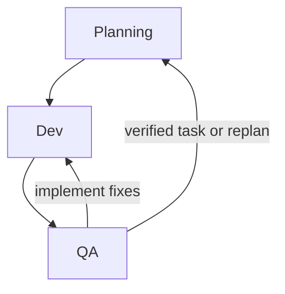
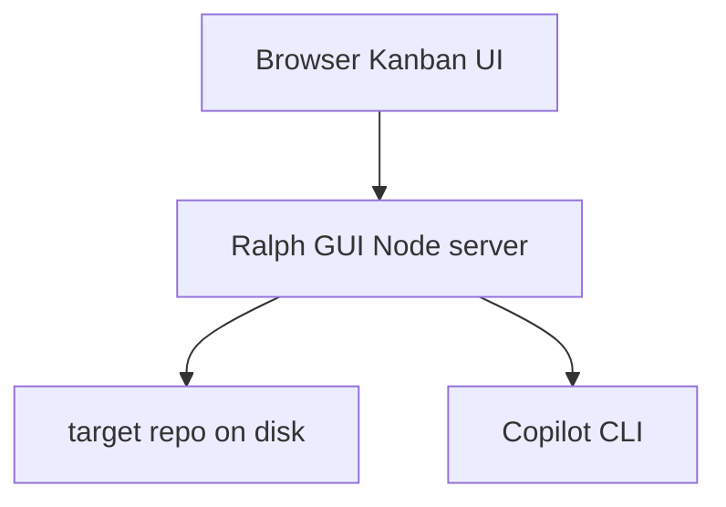
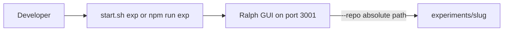

# Ralph GUI

Ralph is an Epic-driven local orchestration loop for software delivery.

It takes a current epic, plans a backlog of tasks from that epic plus the project requirements, executes tasks in a Dev -> QA loop, and persists all runtime state in `ralph/task-status.json`.

### Reset

Remove `ralph/task-status.json` to start a clean loop, otherwise it will try to continue from where it left off.

## Core Concepts

RUN THIS IN A SANDBOX. With the **GitHub Copilot** backend (default), the loop calls `copilot` in "yolo" mode. Other backends are also launched with backend-specific non-interactive/permissive flags so the loop can proceed unattended: Cursor Agent is run with `--output-format text`, Claude is run with `--permission-mode bypassPermissions --output-format text`, and Gemini is run with `--yolo --output-format text`. These modes can reduce or bypass interactive safety prompts, so backend selection has real safety implications and should only be used in isolated environments.

- `requirements.md`:
  The authoritative product requirements document for the overall project. If this is defined elsewhere, just reference those documents in requirements.md. 
  Ralph treats this as the source of truth for the project and must fit its work within those bounds.
- `ralph/epic.md`:
  The current epic Ralph should execute right now.
  The planner uses this to prioritize and sequence tasks.
- `ralph/task-status.json`:
  Task state, next task content, feedback, counters, and blocked metadata.



## Loop Phases

Ralph uses one planning prompt plus Dev and QA prompts:

1. Planning:
   - Reads requirements + epic + codebase state
   - Produces refreshed backlog tasks
   - Orders tasks in backlog by optimal completion order
2. Dev:
   - Implements the selected task
3. QA:
   - Verifies the implementation and returns either verified feedback or actionable fixes



Planning populates and refreshes backlog. Modifying the epic requirements, the agents.md, requirements.md or anything else that would be brought into context will be considered in the next planning loop, which might cause the backlog items to change.

## Prerequisites

- Node.js 20+
- npm 10+
- Git
- **One** installed and authenticated CLI for the agent backend selected in Settings (`ralph/settings.json`), or via `--agent-backend`:

| Backend | Executable | Override env var |
| --- | --- | --- |
| Copilot (default) | `copilot` | `COPILOT_BIN` |
| Cursor Agent | `cursor-agent` | `CURSOR_AGENT_BIN` |
| Claude Code | `claude` | `CLAUDE_BIN` |
| Google Gemini CLI | `gemini` | `GEMINI_BIN` |

Plan, dev, and QA **model names are backend-specific**: what works for Copilot may not apply to Claude Code, Cursor Agent, or Gemini CLI—see each vendor’s CLI documentation.

Reasoning effort support is backend-specific:

| Backend | Dev/QA reasoning effort setting support |
| --- | --- |
| Copilot | Supported (`--reasoning-effort`) |
| Claude Code | Supported (`--effort`) |
| Cursor Agent | Not supported (setting is ignored) |
| Google Gemini CLI | Not supported (setting is ignored) |

If a CLI is not on `PATH`, set the matching `*_BIN` variable to the full executable path (especially on Windows when the command is `copilot.cmd`, `cursor-agent.cmd`, etc.).

### MCP config (optional)

Set `agentMcpConfig` in `ralph/settings.json` (or pass `--mcp-config <path>` to the server so it is persisted the same way). The value is a path to an MCP servers JSON file. Relative paths are resolved from the **target repository root**.

- **GitHub Copilot CLI**: Ralph passes `--additional-mcp-config` with a file reference `@<absolutePath>` (per [Copilot CLI MCP docs](https://docs.github.com/copilot/how-tos/copilot-cli/customize-copilot/add-mcp-servers)), merged with your global `~/.copilot/mcp-config.json` for that run.
- **Claude Code**: Ralph passes `--mcp-config` with the absolute path **before** `-p` (per Claude’s argv rules).
- **Cursor Agent**: If `cursor-agent --help` includes an MCP file flag (e.g. `--mcp-config`), Ralph uses it. If not, the resolved path must be the project file at `<repo>/.cursor/mcp.json` (use that path, or a symlink there). Otherwise Ralph errors with a clear message.
- **Gemini**: The setting is ignored.

## Quick start

```bash
./start.sh
```
Navigate to: `http://localhost:3001` and modify the epic, settings, and repo root. Hit run and monitor from there.


## Local Development

```bash
npm install
npm run dev
```

- Backend: `http://localhost:3001`
- Frontend: Vite dev server



## "Headless Loop" (No UI Required)

Use `start.sh` with a repo and optional settings overrides. The UI is still there, but with this you don't *need* to use it. 

```bash
./start.sh \
  --repo /absolute/path/to/target-repo \
  --start \
  --agent-backend copilot \
  --plan-model claude-sonnet-4.6 \
  --dev-model gpt-5-mini \
  --qa-model gpt-5-mini \
  --dev-reasoning-effort xhigh \
  --qa-reasoning-effort high \
  --max-llm-calls 300 \
  --plan-frequency 1 \
  --min-backlog-size 3 \
  --auto-commit false \
  --exit-when-complete
# Optional: --mcp-config .cursor/mcp.json
```

Behavior:

- installs dependencies if needed
- builds the UI assets
- starts server
- starts loop only when `--start` is passed
- `--start` requires `--repo`, and `ralph/epic.md` must be filled out (not default placeholder)
- optionally exits server when epic completes via `--exit-when-complete`

Use `./start.sh --help` for options.

## Settings Defaults

Default loop settings are:

- `maxLLMCalls: 100`
- `planModel: claude-sonnet-4.6`
- `devModel: gpt-5-mini`
- `qaModel: gpt-5-mini`
- `devReasoningEffort: xhigh`
- `qaReasoningEffort: high`
- `autoCommit: false`
- `planFrequency: 1`
- `minBacklogSize: 3`
- `agentBackend: copilot`

Use your selected CLI’s help output for supported models (for example `copilot --help`, `claude --help`, `cursor-agent --help`, or `gemini --help`).

## Required Requirements File

Ralph refuses to start unless one exists:

- `requirements.md`
- `REQUIREMENTS.md`
- `Requirements.md`
- `docs/requirements.md`
- `docs/REQUIREMENTS.md`

## Experiments

Sample **target repos** live under `experiments/<slug>/` (requirements file + `ralph/epic.md`). The loop implements the product **inside** that folder. From ralph-gui root, `./start.sh exp <slug>` starts Kanban with `--repo` set to that directory (same as an absolute `--repo` path).



- List slugs: `./start.sh exp` with no second argument, or `npm run exp` alone.
- Optional args pass through: `npm run exp -- todo --start`.
- Experiments may include a `material/` folder for screenshots and other static reference files (see [`experiments/todo/README.md`](experiments/todo/README.md)).
- More detail: [`experiments/README.md`](experiments/README.md). Checklist for authors: [`.cursor/skills/ralph-gui-experiment/SKILL.md`](.cursor/skills/ralph-gui-experiment/SKILL.md).

## Useful Scripts

- `npm run dev`
- `npm run build`
- `npm run server`
- `npm run typecheck`
- `npm run test:ci`
- `npm run exp -- <slug>` (Kanban with `--repo` set to `experiments/<slug>`)
